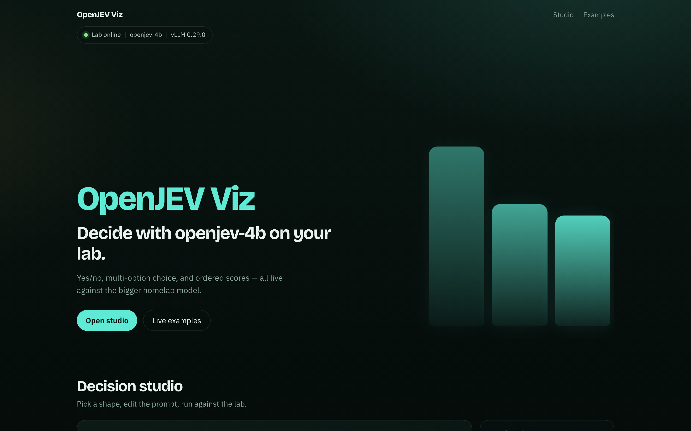
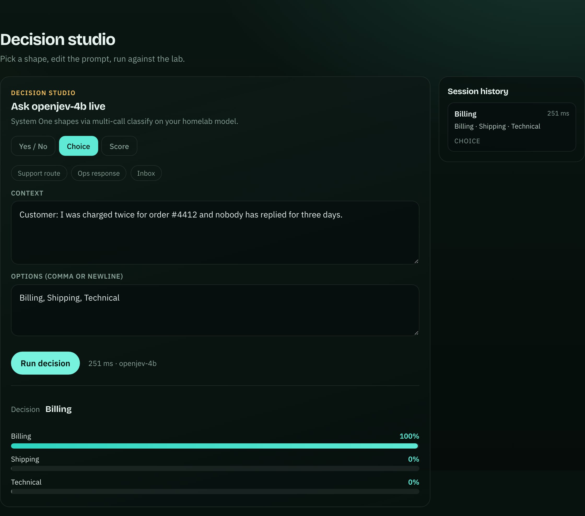
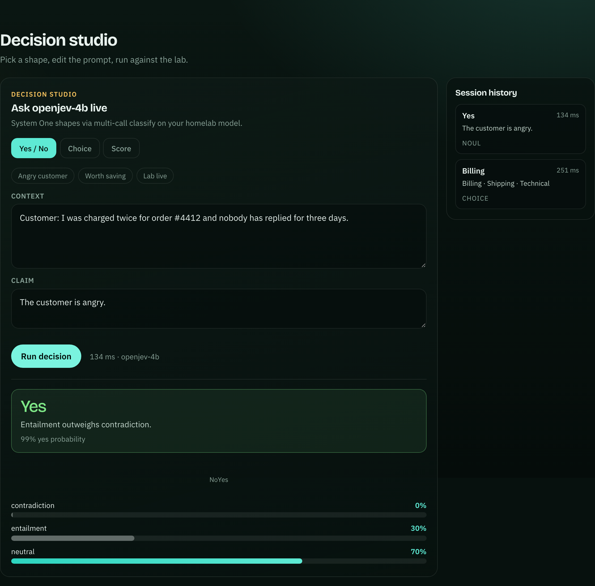
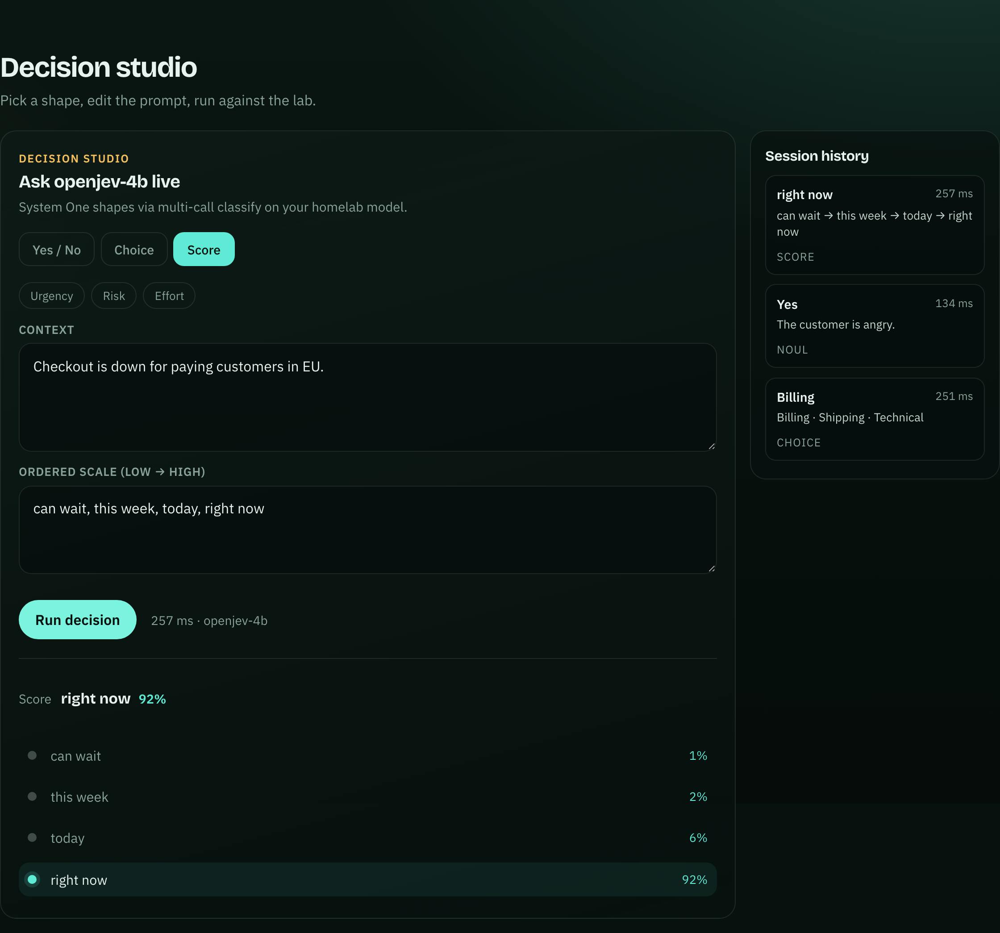
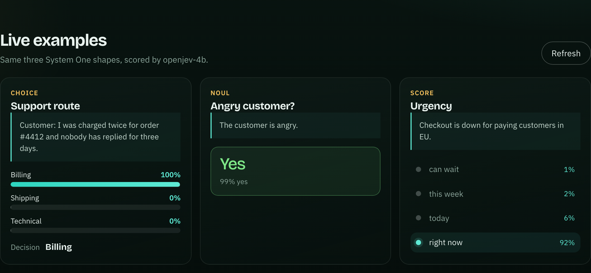

# OpenJEV Viz

Visual playground for [OpenJEV](https://openjev.sh)-style decisions against a homelab model (`openjev-4b` via vLLM).

Ask a claim, pick options, or score a scale — then see calibrated probabilities land in the UI.

<p align="center">
  
</p>

## Screenshots

### Decision studio — Choice

Route a support ticket live. Bars are normalized entailment scores from parallel `/classify` calls.



### Decision studio — Yes / No

Noul-style judgment with a yes probability and raw contradiction / entailment / neutral readout.



### Decision studio — Score

Ordered scale (urgency, risk, effort, …) with a highlighted winner.



### Live examples

Three System One shapes refreshed together from the lab.



## Features

- **Status bar** — lab online/offline, model id (`openjev-4b`), vLLM version
- **Decision studio** — Yes/No, Choice, and Score with editable context and presets
- **Session history** — recent decisions with latency
- **Live examples** — Choice / Noul / Score cards refreshed in parallel
- **Vite proxy** — browser talks to `/lab`, forwarded to your Proxmox host

## How it works

The lab currently exposes vLLM **`/classify`** (not `/v1/systemone`). OpenJEV Viz approximates System One shapes like this:

| Shape | What you provide | What we call |
| --- | --- | --- |
| **Yes / No** | Context + claim | One classify → yes = entailment / (entailment + contradiction) |
| **Choice** | Context + options | One classify per option → normalize yes-weights |
| **Score** | Context + ordered steps | One classify per step → pick the highest weight |

Default proxy target: `http://192.168.1.20:8000`.

## Quick start

```bash
npm install
npm run dev
```

Open [http://127.0.0.1:5173](http://127.0.0.1:5173).

Point the proxy at another host in `vite.config.ts` if needed:

```ts
server: {
  proxy: {
    '/lab': {
      target: 'http://192.168.1.20:8000',
      changeOrigin: true,
      rewrite: (path) => path.replace(/^\/lab/, ''),
    },
  },
}
```

## Scripts

| Command | Description |
| --- | --- |
| `npm run dev` | Vite dev server |
| `npm run build` | Typecheck + production build |
| `npm run preview` | Preview the build |
| `npm run screenshots` | Capture README screenshots (lab must be reachable) |

## Stack

React 19 · Vite 8 · TypeScript · Framer Motion · Playwright (screenshots only)

## License

[MIT](LICENSE)
